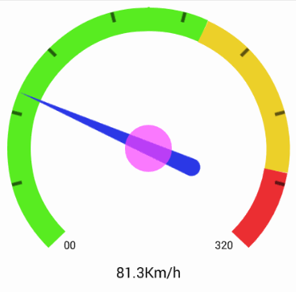
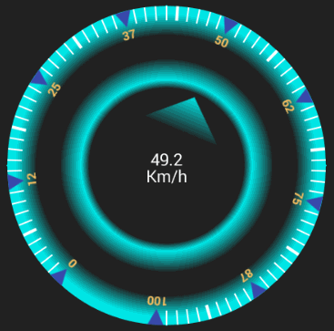
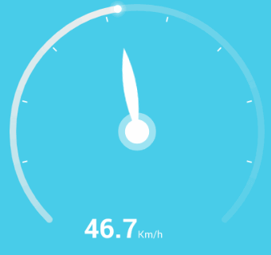
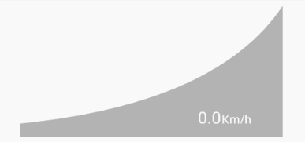

# SpeedView
Dynamic Speedometer, Gauge for Android. **amazing**, **powerful**, and _multi shape_ :zap: , you can change (colors, bar width, shape, text, font ...everything !!), this Library has also made to build **games** with `accelerate` and `decelerate`,
 [see project on GitHub](https://github.com/vasnc9585/SpeedoMeeter).

`minSdkVersion=8`

Library Size just ~ 50 KB.

**Speedometers...**<br/>




**Gauges...**<br/>



# Download

**add this line to** `build.gradle`

```gradle

dependencies {
	    compile 'com.chinnadurai.speed:meeterlib:1.1.6'
}

```

for **maven**

```maven
<dependency>
  <groupId>com.github.anastr</groupId>
  <artifactId>speedviewlib</artifactId>
  <version>1.1.6</version>
  <type>pom</type>
</dependency>
```
**[Get Starting](https://github.com/anastr/SpeedView/wiki/0.-Get-Started)** with _SpeedView Library_.
# Simple Usage
choose one of Speedometers, gauges and add it to your `Layout.xml`, here we use **SpeedView**.<br>
```xml

<com.chinnadurai.speed.meeterlib.SpeedView
        android:id="@+id/speedView"
        android:layout_width="250dp"
        android:layout_height="wrap_content" />

```